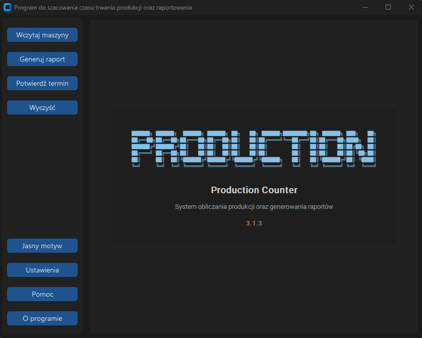

# Production Counter

Production Calculation and Reporting System

## 📷 Screenshots

### Main Application Dashboard

## 🚀 Key Features

- **Production Time Estimation:** The program calculates production groups for each machine and estimates how long it will take to finish all scheduled orders.
- **Report Management:** Generates detailed reports for warehouse logistics and the foil cutting center.
- **Geometry & BOM Management:** Streamlined processing of profile indices, assembly configurations, and custom foil cutting parameters.
- **Auto-Update Notification System:** Built-in version checking mechanism that automatically triggers a pop-up window notifying the user whenever a newer release is deployed on the network server.
